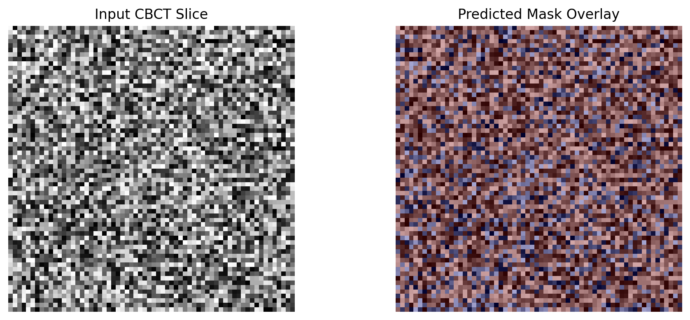

# Dental CBCT Segmentation (MONAI Bundle)

## Overview

This bundle provides a research-oriented MONAI-based 3D segmentation model for dental CBCT volumes.

The model is designed to segment regions of interest (ROI) from CBCT scans, such as tooth structures or bone regions, as part of a multimodal dental imaging workflow.

This bundle is derived from a large prototype system that integrates:
- CBCT volume visualization
- Multimodal fusion (Panoramic + CBCT + Soft tissue)
- Segmentation overlays
- DICOM-ready ingestion pipeline

---

## Task

3D Medical Image Segmentation
Modality: CBCT (Cone Beam Computed Tomography)

---

### Model

- Architecture: 3D UNet (MONAI)
- Input shape: `[1, 64, 64, 32]`
- Output: Binary segmentation mask

---

## Usage

### Inference

```bash
python -m monai.bundle run \
  --bundle_root . \
  --config_file configs/inference.json


## Inference Pipeline

- Load CBCT volume (NIfTI format)
- Convert to tensor
- Run 3D UNet model
- Apply sigmoid + threshold
- Save output mask as NIfTI


# Example training command (requires dataset setup)
python -m monai.bundle run \
  --bundle_root . \
  --config_file configs/train.json  


## Sample Output

Below is an example segmentation result:

